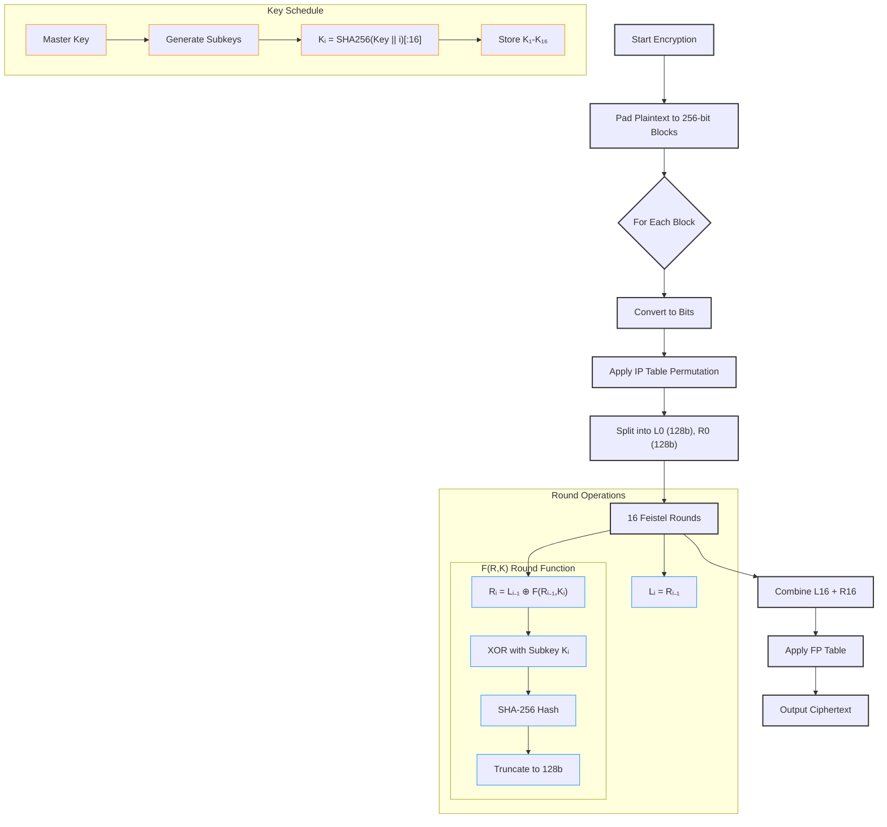

 # **Gödel Encryption Algorithm**  

**A Modern Feistel Cipher with SHA-256 Integration**  

## **Overview**  
The **Gödel Encryption Algorithm** is a symmetric-key block cipher designed for secure data encryption. Inspired by the classic **DES (Data Encryption Standard)**, it improves upon traditional Feistel networks by integrating **SHA-256** for enhanced cryptographic strength.  

### **Key Features**  
✔ **256-bit block size** (resistant to block cipher attacks)  
✔ **128-bit key size** (secure against brute force)  
✔ **16-round Feistel structure** (balanced security & performance)  
✔ **SHA-256-based round function** (strong diffusion & confusion)  
✔ **Customizable subkey generation** (via SHA-256 hashing)  

---

## **Algorithm Design**  

### **1. Encryption Process**  
1. **Initial Permutation (IP)** – Rearranges plaintext bits using a fixed permutation table.  
2. **Feistel Rounds (16 rounds)** – Each round applies:  
   - **XOR with subkey**  
   - **SHA-256 hashing** (truncated to 128 bits)  
   - **Bitwise mixing** between left & right halves  
3. **Final Permutation (FP)** – Reverses the initial permutation.  

### **2. Decryption Process**  
- Identical to encryption but reverses subkey order.  

### **3. Key Schedule**  
- Subkeys are derived using **SHA-256** hashing of the master key and round index.  
- Ensures **strong key diffusion** without weak keys.  

---

## **Comparison with DES & AES**  

| **Feature**       | **Gödel**        | **DES**          | **AES-128**      |
|-------------------|------------------|------------------|------------------|
| **Block Size**    | 256 bits         | 64 bits          | 128 bits         |
| **Key Size**      | 128 bits         | 56 bits          | 128 bits         |
| **Rounds**        | 16               | 16               | 10               |
| **Security**      | Strong (SHA-256) | Weak (broken)    | Very Strong      |
| **Performance**   | Moderate         | Fast (but weak)  | Very Fast        |
| **Structure**     | Feistel Network  | Feistel Network  | SPN (Substitution-Permutation) |

### **Advantages Over DES**  
✅ **Larger block size** (prevents birthday attacks in block cipher modes)  
✅ **Stronger round function** (SHA-256 instead of custom S-boxes)  
✅ **No weak keys** (unlike DES, which has 16 weak/semi-weak keys)  

### **Trade-offs vs. AES**  
⚠ **Slower** (due to SHA-256 in each round)  
⚠ **Not hardware-optimized** (AES has dedicated CPU instructions)  
⚠ **Less analyzed** (AES is a NIST standard with extensive cryptanalysis)  

---

## **Usage (Python Implementation)**  

### **Installation**  
No dependencies required (uses built-in `hashlib` for SHA-256).  

### **Example Code**  
```python
from godel import GODEL

# Initialize with a 128-bit (16-byte) key
key = b"powyrlsiqlmfyrus" 
godel = GODEL(key)

# Encrypt
plaintext = b"What is encryption?"
ciphertext = godel.encrypt(plaintext)  
print("Ciphertext (hex):", ciphertext.hex())

# Decrypt  
decrypted = godel.decrypt(ciphertext)  
print("Decrypted:", decrypted.decode())
```

and this is the output for this sample

```txt
Encrypted (hex): 000f7bba02fc1d38424f078b2682262af7fb03926a97d76a306040cdfc0e4b03
Decrypted plaintext: What is encryption?
```

## Flow of the Godel algorithm

